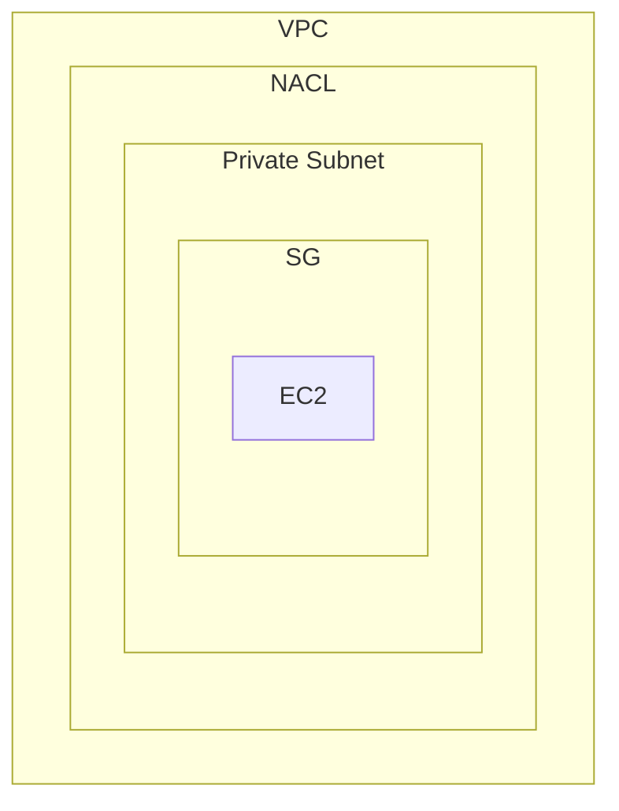

# 階層圖

```markmap
- VPC
	- Private Subnet
		- EC2
	- Route Table
		- 目的地 IP
		- 下一站
	- Public Subnet
		- EC2
		- NAT GW(Gateway)
	- IGW(Internet Gateway)
```

# 說明

在 VPC 中每一個 Subnet 都有一個 Route Table 決定目的地 IP 以及下一站，Public Subnet 用來跟 Internet 溝通。

1. NAT GW 只能建立在 Public Subnet
2. IGW 隸屬在 VPC 層級下
3. Inetrnet 連線與 IGW 溝通
4. VPC 內連線與 NAT GW 溝通

# 防火牆機制



:::warning
SG 是一個 statful 的工具，會記錄流量從哪裡進來或者出去。
:::

# 參考

[AWS 專家教你：打造高效 VPC 網絡（包含 Subnet、IGW、NAT等）](https://www.youtube.com/watch?v=0YG3vo78gSM&t=184s)