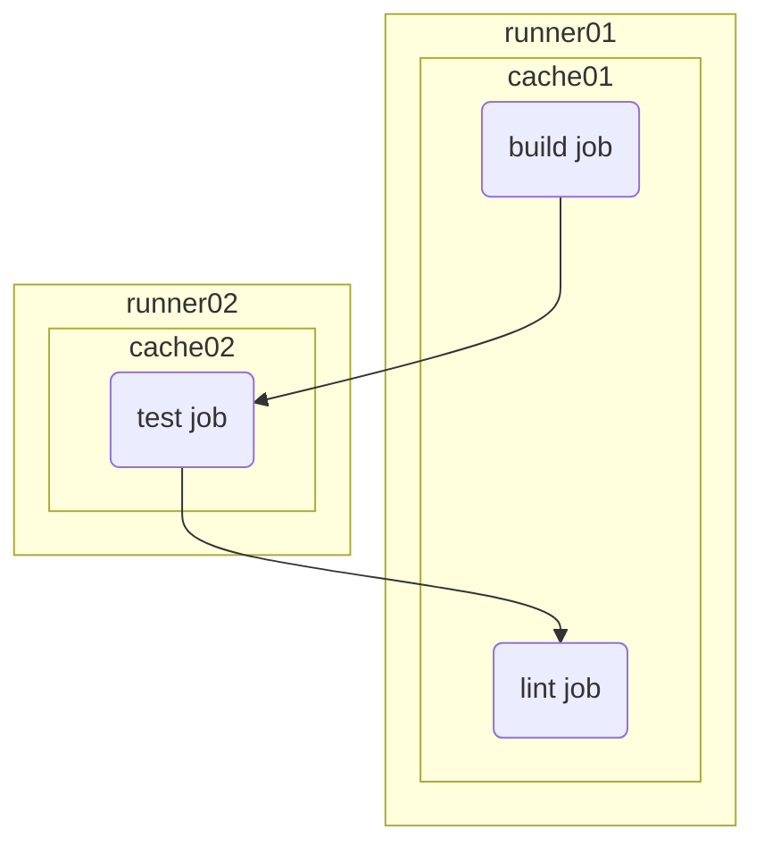
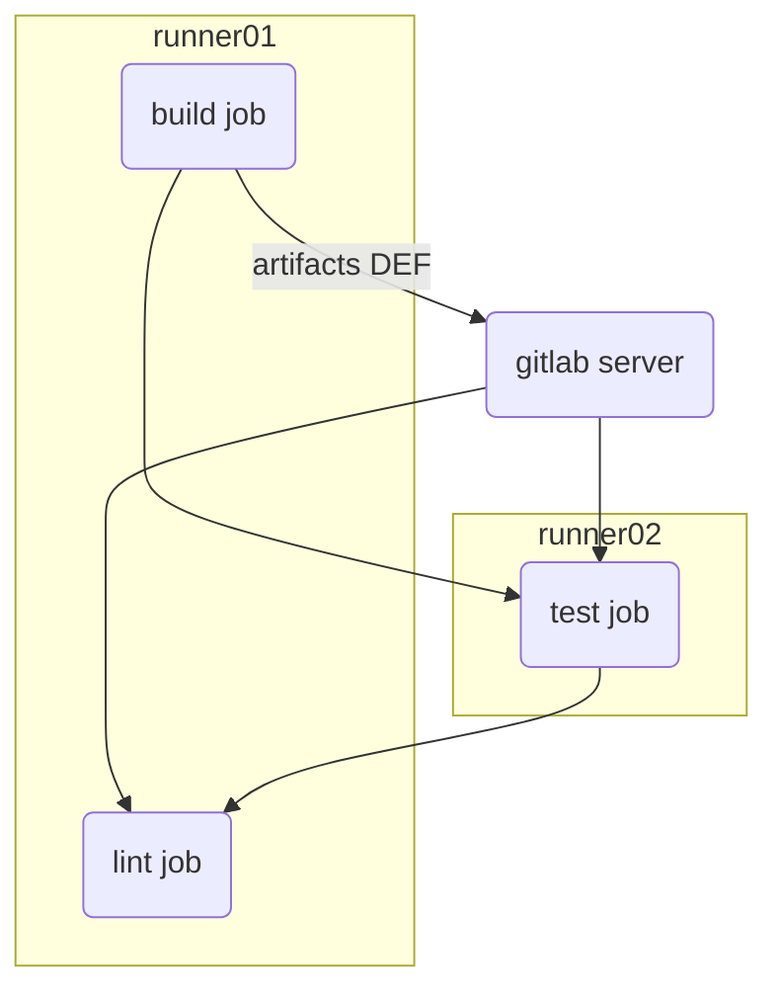

# 介紹
gitlab pipeline 是一條流水線，每一條流水線可以有一個或多個 job，每個 job 工作都是從頭開始，並且不知道前一項 job 的結果

如果不使用 cache 或 artifacts 執行程式要安裝依賴項時必須存取網路並下載必要的套件。

# 什麼是 cache ?
它是 job 在執行前下載並在執行後上傳的一組檔案

在沒有 cache 的情況下 runner 也能工作並且將 cache 結果上傳到 runner

在第三個 lint job 時，會在 runner01 上找到 cache 並使用它，執行後會將 cache 上傳回來

# 對 dependencies 使用 cache
在打包或編譯程式碼時，常會需要從網路上下載套件。快取儲存在 GitLab Runner 的位置，如果啟用分散式儲存，快取會上傳到 S3。

- 標記 runner
- 僅適用於特定項目的 runner
- 使用 key，可以為每個分支配置不同的快取

為了減少唯一差異是拉取策略的作業重複。

- `pull-push` 用於更改預設分支
- `pull` 對於其他分支的更改

# 什麼是 artifacts ?
artifacts 是執行 job 後儲存在 gitlab 伺服器上面的檔案，後續 job 將在腳本執行前下載 artifacts

# 參考
[GitLab CI: Cache and Artifacts explained by example](https://dev.to/drakulavich/gitlab-ci-cache-and-artifacts-explained-by-example-2opi)

[GitLab CI/CD 中的快取](https://docs.gitlab.com/ee/ci/caching/)