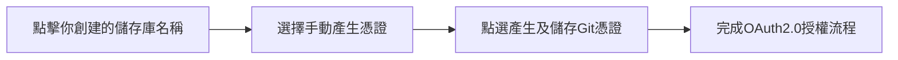
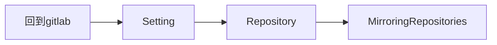

# Gitlab mirror

<br>

首先用以下命令查看你選擇的項目:id: 
```
gcloud config get-value project
```
如果未返回ID的話，請指定項目名稱。
```
gcloud config set project <project id>
```
啟用 Cloud Source Repositories API。
```
gcloud services enable sourcerepo.googleapis.com
```
在 Cloud Source Repositories 中創建 Git 存儲庫。
```
gcloud source repos create <repo name>
```

<br>

### 生成靜態憑據

在Configure Git頁面上，將突出顯示的文本區域複製到剪貼板。


將複製內容黏貼到終端機執行，並從生成憑據提取密碼。
```
grep 'source.developers.google.com' ~/.gitcookies | tail -1 | cut -d= -f2
```
用戶名存儲在CSR_USER環境變量中:
```
CSR_USER=$(grep 'source.developers.google.com' ~/.gitcookies | \
    tail -1 | cut -d$'\t' -f7 | cut -d= -f1)
```
將存儲庫的 URL 存儲在CSR_REPO環境變量中:
```
CSR_REPO=$(gcloud source repos describe <repo name> --format="value(url)")
```
將存儲庫的 URL（包括用戶名）打印到控制台:
```
echo $CSR_REPO | sed "s/:\/\//:\/\/${CSR_USER}@/"
```
### mirror

將URL以及密碼貼上。

設置完以後，會看到下方有一個條目。

### 故障排除
如果在Cloud Source Repositories看不到提交內容，請查看 GitLab 項目中的鏡像配置（Settings > Repository > Mirroring repositories）。
如果將提交從 GitLab 推送到 Cloud Source Repositories 時出錯，您會在Mirrored repositories表中看到一個錯誤標籤。將指針放在標籤上以查看錯誤的詳細信息。

[參閱官方文件](https://cloud.google.com/architecture/mirroring-gitlab-repositories-to-cloud-source-repositories)
###### tags: `gitlab`