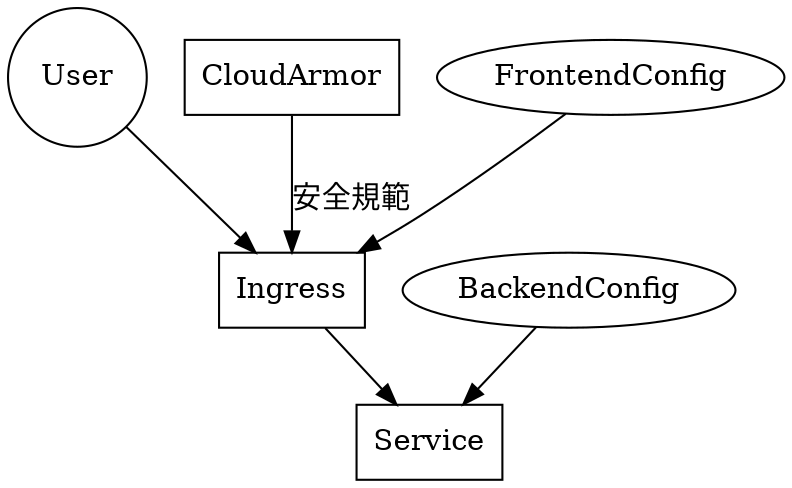

# Ingress 與 Armor 安全性政策
 

參考網站 :point_right: [練習：使用後端服務設置Ingress 超時](https://cloud.google.com/kubernetes-engine/docs/how-to/ingress-features#exercise)
參考網站例題用 backendconfig 對 ingress 原因是在於官方文件說明的這句 :point_down: 
:::info
如果Ingress 引用了某一Service 端口，並且該Service 端口與BackendConfig 相關聯，則HTTP(S) 負載平衡後端服務會從BackendConfig 中獲取其部分配置。
:::
 
 

 

###### tags: `k8s` `ingress` `armor`