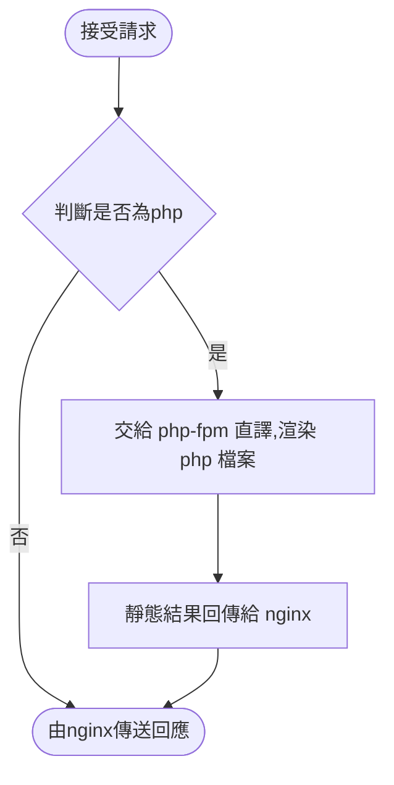
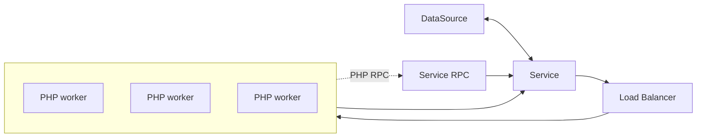
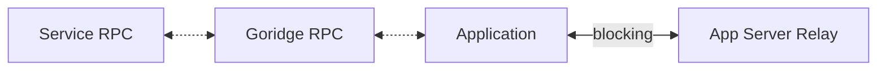

# Laravel Octane + LoadRunner

## Laravel 簡介

Laravel 是開發 PHP 所使用的的一種框架。所謂的框架就是工程師必需要按照框架所制定的==規範==來設計。

:::info

那什麼是 Octane? 

:::

### Laravel Octane

Laravel Octane 就是進階版的 Laravel，能為==應用程式==提供高性能的服務。支援 **Swoole & RoadRunner**

 

### LoadRunner

:::info

上述提到 Octane 支援 RoadRunner，用處是?

:::

一般網頁的架構 ==nginx + php-fpm==，下圖得知 nginx & php-fpm 是合作關係，**RoadRunner** 類似整合 nginx + php-fpm，就能獨自處理這些事物。

#### LoadRunner 工作圖

:star: RPC(Remote Procedure Call) 是一種分散式系統溝通法

##### golang

在 golang 這層，會 run PHP application 在 goroutine 上。會有附載平衡分散給 PHP worker 執行

##### PHP

:::info
Goridge 是高性能的 PHP 到 Golang 編解碼器
:::

RoadRunner 會讓 PHP worker 維持在 alive 再請求進來之前，可以提高速度跟對 application 重度負載能力 

###### tags: `php` `laravel`