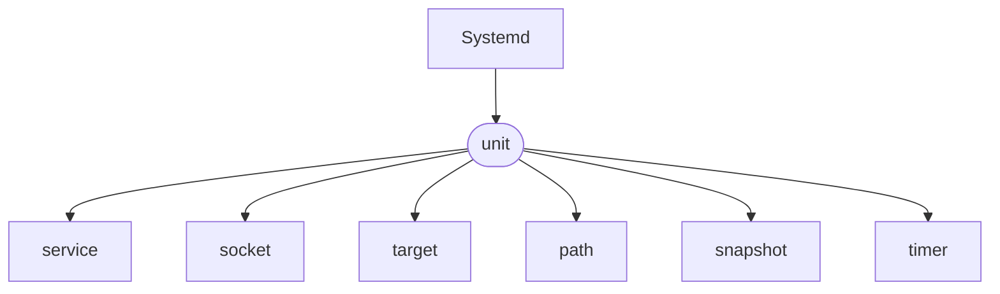

# Systemd基本管理服務

[Linux systemd 系統服務管理基礎教學與範例](https://blog.gtwang.org/linux/linux-basic-systemctl-systemd-service-unit-tutorial-examples/)

---

**介紹如何在 Linux 底下使用 systemctl 指令管理 systemd 的系統服務**

在 Systemd 中每一個系統服務就稱為一個服務單位(unit)， 而服務單位又可以區分為 service、socket、target、path、snapshot、timer 等多種不同的類型(type)

==我們可以從設定檔的副檔名來判斷該服務單位所屬的類型==



<br>

## 基本服務管理

如果要管理 Systemd 中的各種服務，可以使用 systemctl 這個指令，配合各種操作指令來進行各種操作。

:::info
* start 啟動
* status 狀態
* stop 停止
* enable/disable 啟用、停用開機自動啟動服務
:::

:star: 當我們在指定服務名稱時，可以將結尾的 .service 省略，這樣可以少打一些字

```
systemctl 操作指令 服務名稱.service
```

---

## 檢測系統服務狀態

```
# 檢查 nginx 服務是否正在運行
systemctl is-active nginx.service

# 檢查 nginx 服務是否有設定開機自動啟動
systemctl is-enabled nginx.service

# 檢查 nginx 服務是否啟動失敗
systemctl is-failed nginx.service
```

---

## 列出 Systemd 所有服務

:::info
* --all : 列出系統上所有的服務（包含已啟動與未啟動的）
* --state=inactive : 列出未啟動的所有服務
* --type=[服務類型] : 指定服務的類型
:::

```
# 列出所有已啟動的服務
systemctl list-units
# 可以省略 list-units
systemctl
```

:star: list-units 的輸出包含許多欄位，以下是各個欄位的說明。
|    欄位     |                      說明                |
|:-----------:|:---------------------------------------:|
|    Unit     |          Systemd 服務單位（unit）名稱      |
|    Load     | 該服務單位設定檔是否有被 Systemd 載入至記憶體中|
|   Active    |                是否已經正常啟動            |
|     Sub     |   更詳細的狀態說明，值會因為不同服務有所不同   |
| Description |              關於此服務的簡單說明          |

<br>

## 服務內部設定與狀態
如果想要查看指定服務的 Systemd 設定檔內容，可以用 cat 操作指令將設定檔印出來
```
systemctl cat atd.service
```

<br>

###### tags: `linux`