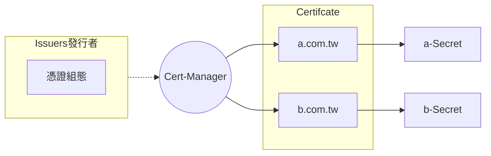

# k8s Cert-Manager

## 簽發憑證的做法：

1. 自簽憑證的 TLS 憑證

:::info

某些內部服務其實並不需要被公開存取，但希望達到的是資料在點對點傳輸的過程中必須要是加密的。所以可以使用自己組織簽發的 TLS 憑證

:::

2. 正規的 CA 機構簽發

:::info

公開的網路服務，就必須透過正規的 CA 機構來簽發才行，而在以前通常都必須要花錢去購買 TLS 憑證

:::

<br>

## 憑證的管理

:star: 當你申請的憑證有越來越多張，需要管理的時候。

### cert-manager

cert-manager 是基於 Kubernetes 所開發的`憑證管理工具`，它可以可以幫忙發出來自各家的 TLS 憑證



:::info

* Issuer：作用範圍只在某個 K8S Namespace 內
* ClusterIssuer：作用範圍為整個 K8S Cluster

:::

```markmap
- Issuers
  - 設定簽發 TLS 憑證組態
  - Issuers
    - acme
      - server
      - email
      - privateKeySecretRef
      - solvers
  - ClusterIssuers
- TLS Certifcate
  - secretName
  - duration
  - renewBefore
  - dnsNames
  - acme
  - issuerRef
    - name
    - kind 
```

###### tags: `k8s` `GKE`